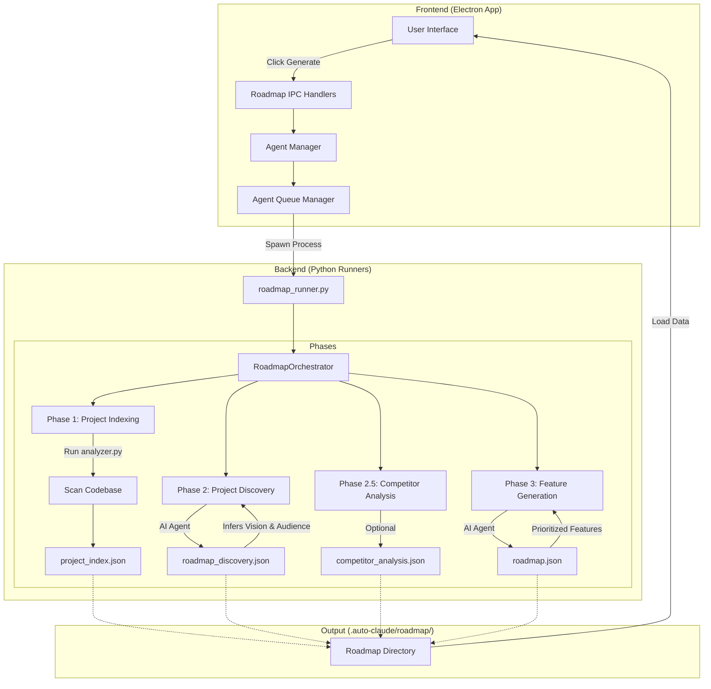

# Tính năng Roadmap trong Auto-Claude

Tính năng **Roadmap** giúp bạn tự động phân tích toàn bộ dự án (codebase) để xây dựng một kế hoạch phát triển chiến lược, bao gồm các tính năng ưu tiên, các giai đoạn thực hiện (Phases) và cột mốc (Milestones).

## Luồng hoạt động (Architecture Diagram)

## Giải thích chi tiết các thành phần

### 1. Quét Codebase (Indexing Phase)
Đây là bước đầu tiên và quan trọng nhất. Auto-Claude sử dụng một công cụ gọi là `analyzer.py` để quét toàn bộ thư mục dự án của bạn. 
- **Nhiệm vụ**: Xác định cấu trúc thư mục, các ngôn ngữ lập trình đang dùng, các thư viện/framework chính, và các thành phần cốt lõi của ứng dụng.
- **Kết quả**: Tạo ra file `project_index.json` đóng vai trò là "bản đồ tóm tắt" của toàn bộ dự án để AI có thể hiểu nhanh mà không cần đọc từng file code.

### 2. Khám phá Dự án (Discovery Phase)
Sau khi có bản chỉ mục, một AI Agent chuyên biệt (`Roadmap Discovery Agent`) sẽ được kích hoạt.
- **Nhiệm vụ**: Đọc bản chỉ mục, file README, lịch sử git để suy luận ra:
    - Tầm nhìn của sản phẩm (Product Vision).
    - Đối tượng khách hàng mục tiêu (Target Audience).
    - Các vấn đề hiện tại mà dự án đang giải quyết.
- **Kết quả**: Lưu thông tin vào `roadmap_discovery.json`.

### 3. Phân tích đối thủ (Competitor Analysis - Tùy chọn)
Nếu được bật, hệ thống sẽ thực hiện nghiên cứu thị trường dựa trên thông tin từ giai đoạn Discovery để tìm ra các cơ hội khác biệt hóa cho sản phẩm.

### 4. Lên lộ trình phát triển (Feature Generation Phase)
Đây là giai đoạn cuối cùng, sử dụng AI Agent (`Roadmap Features Agent`) để lên kế hoạch.
- **Nhiệm vụ**: Dựa trên tất cả dữ liệu đã thu thập được để:
    - Đề xuất các tính năng mới cần thiết.
    - Ưu tiên tính năng theo khung **MoSCoW** (Must-have, Should-have, Could-have, Won't-have).
    - Gom nhóm các tính năng vào từng giai đoạn phát triển (ví dụ: MVP, Giai đoạn 1, Giai đoạn 2).
    - Xác định các cột mốc (Milestones) và sự phụ thuộc giữa các tính năng.
- **Kết quả**: File `roadmap.json` hoàn chỉnh được gửi ngược về giao diện để hiển thị dưới dạng bảng Kanban.

## Chuyển từ Roadmap sang Thực thi
Một điểm mạnh của Auto-Claude là bạn có thể nhấn vào bất kỳ tính năng nào trong bảng Roadmap và chọn **"Convert to Spec"**.
- Hệ thống sẽ tự động tạo một Specification (bản đặc tả kỹ thuật) dựa trên mô tả tính năng.
- Từ đó, bạn có thể bắt đầu cho AI lập trình tính năng đó ngay lập tức.
